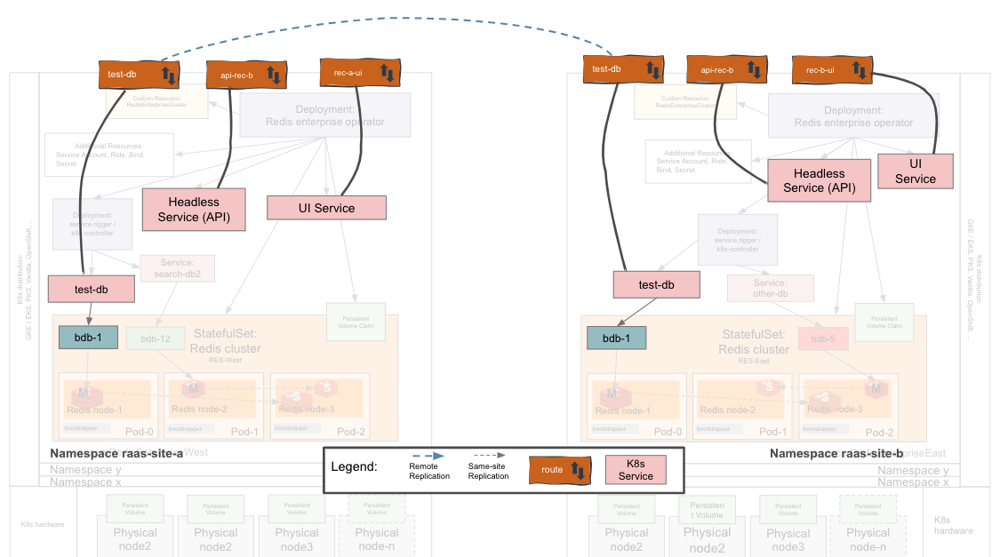
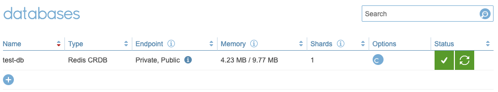

# How to Create an Active-active Database (CRDB) in Redis Enterprise for Openshift


## Pre-requisites 

* Two working Redis Enteprise Clusters (REC) in different Openshift environments
  * Important Note: the two RECs should have *different* `names`/`fqdn`. If this is not met, the CRDB creation will result in bad state.
* REC _admin role_ credentials to both RECs
* Appropriate resources available in each REC to create DBs of the requested size.
* Openshift Permissions: a role that allows the creation of Openshift routes
* Command line tools `kubectl` or `oc` and `jq`

## Topology


## High Level Workflow
The following is the high level workflow which you will follow:
1. Document the required parameters.
2. Apply the `activeActive` spec to both clusters.
3. Formulate the CRDB creation JSON payload using the parameters *from both RECs* in a single JSON document.
4. POST the JSON payload *to one* of the REC's API endpoints. (Yes, just one; it will coordinate with the other(s).)
5. Run a workload.


## Required Parameters
The following parameters will be required to form the JSON payload to create the CRDB. 
| Parameter | Parameter Name in REST API | Description | How to get it? |
| --------- | ---  |  --- | --- |
| <a href="name"></a>Cluster FQDN | `name`  | This is the name of the REC from the REC perspective  | `curl -u <user>:<password> https://<rec_api>/v1/cluster \| jq .name` |
| <a href="url"></a>API URL | `url`  | This is the route the API endpoint as specified in `apiIngressURL`. Should be prefixed with `https://` | `oc get rec -o json \| jq '.items[].spec.activeActive.apiIngressUrl'` |
| Cluster Admin Username/password | `credentials` | Cluster Admin role username/password | `get secret <cluster_name>  --template={{.data.password}} \| base64 -D`
| Replication Endpoint | `replication_endpoint`  | This will be <`your_db_name`><`dbIngressSuffix`>:443 where `dbIngressSuffix` is specified in your `activeActive` spec | `oc get rec -o json \| jq '.items[].spec.activeActive.dbIngressSuffix'` |
| Replication TLS SNI | `replication_tls_sni` | This is the same as your `replication_endpoint`, but no port number required. | As above.


Here is an example when creating a CRDB with database name <i>test-db</i>:
| Parameter Name in REST API | Example value | 
| -------------------------- | ------------- |
| `name` | rec-a.raas-site-a.svc.cluster.local |
| `url` | `https://api-raas-site-a.apps.bbokdoct.redisdemo.com` |
| `credentials` | username: `b@rl.com`, password: `something` | 
| `replication_endpoint` | <i>test-db</i><span style="color:orange">-raas-site-a.apps.bbokdoct.redisdemo.com</span>:443  |
| `replication_tls_sni` | <i>test-db</i><span style="color:orange">-raas-site-a.apps.bbokdoct.redisdemo.com</span> |

*Note:* My openshift cluster creates routes at the subdomain `*.apps.bbokdoct.redisdemo.com` by default where my openshift cluster name is `bbokdoct.redisdemo.com`.

## Let's go!

Ensure you've documented the required parameters as in the above section. You'll need these!

*Important Note:* In the samples below I am creating two Redis Enterprise Clusters (RECs) in the *same* Openshift cluster but two distinct namespaces. The same steps will apply for RECs in different Openshift clusters. 

### 1. Document the Required Parameters

As in the above section: Required Parameters.

### 2. Apply the activeActive Spec

Apply the `activeActive` spec to both Redis Enterprise clusters appropriately. Details about the REC API are <a href="https://github.com/RedisLabs/redis-enterprise-k8s-docs/blob/master/redis_enterprise_cluster_api.md" target="_blank">here</a>.

REC at site A:
```
  activeActive: # edit values according to your cluster
    apiIngressUrl:  api-raas-site-a.apps.bbokdoct.redisdemo.com 
    dbIngressSuffix: -raas-site-a.apps.bbokdoct.redisdemo.com 
    method: openShiftRoute
```
REC at site B:
```
  activeActive: # edit values according to your cluster
    apiIngressUrl: api-raas-site-b.apps.bbokdoct.redisdemo.com 
    dbIngressSuffix: -raas-site-b.apps.bbokdoct.redisdemo.com
    method: openShiftRoute
```    

You can validate that these were applied by describing the `rec` as follows:
```
$ oc get rec -n raas-site-a -o json | jq '.items[].spec.activeActive'
{
  "apiIngressUrl": "api-raas-site-a.apps.bbokdoct.redisdemo.com",
  "dbIngressSuffix": "-db-raas-site-a.apps.bbokdoct.redisdemo.com",
  "method": "openShiftRoute"
}
$ oc get rec -n raas-site-b -o json | jq '.items[].spec.activeActive'
{
  "apiIngressUrl": "api-raas-site-b.apps.bbokdoct.redisdemo.com",
  "dbIngressSuffix": "-db-raas-site-b.apps.bbokdoct.redisdemo.com",
  "method": "openShiftRoute"
}
```

This will result in the API route `api-`<`clustername`> being added in both sites as below:

Redis Enterprise Cluster in Site A
```
$ oc get all
NAME                                             READY   STATUS    RESTARTS   AGE
pod/rec-a-0                                      2/2     Running   0          13m
pod/rec-a-services-rigger-7864cf7987-bsl4m       1/1     Running   0          13m
pod/redis-enterprise-operator-5d4dcf5dfc-7gklr   1/1     Running   0          152m

NAME               TYPE        CLUSTER-IP       EXTERNAL-IP   PORT(S)                      AGE
service/rec-a      ClusterIP   None             <none>        9443/TCP,8001/TCP,8070/TCP   13m
service/rec-a-ui   ClusterIP   172.30.225.190   <none>        8443/TCP                     13m

NAME                                        READY   UP-TO-DATE   AVAILABLE   AGE
deployment.apps/rec-a-services-rigger       1/1     1            1           13m
deployment.apps/redis-enterprise-operator   1/1     1            1           152m

NAME                                                   DESIRED   CURRENT   READY   AGE
replicaset.apps/rec-a-services-rigger-7864cf7987       1         1         1       13m
replicaset.apps/redis-enterprise-operator-5d4dcf5dfc   1         1         1       152m

NAME                     READY   AGE
statefulset.apps/rec-a   1/1     13m

NAME                                 HOST/PORT                                          PATH   SERVICES   PORT   TERMINATION   WILDCARD
route.route.openshift.io/api-rec-a   api-raas-site-a.apps.bbokdoct.redisdemo.com               rec-a      api    passthrough   None
route.route.openshift.io/rec-ui-a    rec-ui-a-raas-site-a.apps.bbokdoct.redisdemo.com          rec-a-ui   ui     passthrough   None
```


Redis Enterprise Cluster in Site B:
```
$ oc get all
NAME                                             READY   STATUS    RESTARTS   AGE
pod/rec-b-0                                      2/2     Running   0          150m
pod/rec-b-services-rigger-5d5d8ffb44-vp5xr       1/1     Running   0          150m
pod/redis-enterprise-operator-5d4dcf5dfc-w2v4g   1/1     Running   0          150m

NAME               TYPE        CLUSTER-IP       EXTERNAL-IP   PORT(S)                      AGE
service/rec-b      ClusterIP   None             <none>        9443/TCP,8001/TCP,8070/TCP   150m
service/rec-b-ui   ClusterIP   172.30.223.236   <none>        8443/TCP                     150m

NAME                                        READY   UP-TO-DATE   AVAILABLE   AGE
deployment.apps/rec-b-services-rigger       1/1     1            1           150m
deployment.apps/redis-enterprise-operator   1/1     1            1           150m

NAME                                                   DESIRED   CURRENT   READY   AGE
replicaset.apps/rec-b-services-rigger-5d5d8ffb44       1         1         1       150m
replicaset.apps/redis-enterprise-operator-5d4dcf5dfc   1         1         1       150m

NAME                     READY   AGE
statefulset.apps/rec-b   1/1     150m

NAME                                 HOST/PORT                                          PATH   SERVICES   PORT   TERMINATION   WILDCARD
route.route.openshift.io/api-rec-b   api-raas-site-b.apps.bbokdoct.redisdemo.com               rec-b      api    passthrough   None
route.route.openshift.io/rec-b-ui    rec-b-ui-raas-site-b.apps.bbokdoct.redisdemo.com          rec-b-ui   ui     passthrough   None
```


### 3. Create the JSON Payload

Create the JSON payload for CRDB creation request as in this <a href="./crdb.json" target="_blank">example</a> using the required parameters. Save the file as `crdb.json` in your current working directory.
```
{
  "default_db_config": {
    "name": "<db_name>",
    "replication": false,
    "memory_size": 10240000,
    "aof_policy": "appendfsync-every-sec",
    "shards_count": 1
  },
  "instances": [
    {
      "cluster": {
        "url": "<site_a_api_endpoint>",
        "credentials": {
          "username": "<site_a_username>",
          "password": "<site_a_password>"
        },
        "name": "<site_a_rec_name/fqdn>",
        "replication_endpoint": "<site_a_replication_endpoint>443",
        "replication_tls_sni": "<site_a_replication_endpoint>"
      }
    },
    {
      "cluster": {
        "url": "<site_b_api_endpoint>",
        "credentials": {
          "username": "<site_b_username>",
          "password": "<site_b_password>"
        },
        "name": "<site_b_rec_name/fqdn>",
        "replication_endpoint": "<site_b_replication_endpoint>:443",
        "replication_tls_sni": "<site_b_replication_endpoint>"
      }
    }
  ],
  "name": "<db_name>",
  "encryption": true,
  "compression": 0
}
```
### 4. Request the Active-Active DB with the JSON Payload

In this step you will make the Active-Active DB request to just one cluster member. *Why just one?* This request is coordinated among members: You request one member to initiate the coordination *by including* the list of, and credentials for, each Active-Active DB member. 

Apply the following to the API endpoint at *just one* cluster API endpoint:

`curl -k -u b@rl.com:<snip> https://api-raas-site-a.apps.bbokdoct.redisdemo.com/v1/crdbs -X POST -H 'Content-Type: application/json' -d @crdb.json`

*Note:* `curl` some users are having difficulty specifying the payload with the `-d` argument. Please consult your curl manual or try postman. 

You should see a reply from the API as in the following which indicates the payload was well formed and the request is being actioned:
```
{
  "id": "aac6ff9a-ff54-49c2-8398-f62b1896c69a",
  "status": "queued"
}
```
*Note* Did you get something other than `queued` as a response? Then proceed to the [troubleshooting](#troubleshooting) section of the document. 

<a href="crdb_tasks"></a>
You can get the status of the above task by issuing a GET on `/v1/crdbs_tasks/<id>`. Here is an example of a failed task:
```
$ curl -k -u b@rl.com:<snip> https://api-raas-site-a.apps.bbokdoct.redisdemo.com/v1/crdb_tasks/aac6ff9a-ff54-49c2-8398-f62b1896c69a
{
  "crdb_guid": "5f04ae65-6d4c-4c22-8081-08906864560a",
  "id": "aac6ff9a-ff54-49c2-8398-f62b1896c69a",
  "status": "finished"
}
```

If successful, you will see the DB created in the Redis Enterprise UI for a healthy and syncing CRDB:


You will also see two new services per cluster: `test-db` and `test-db-headless`, as well as a new route which is used for the replication: `test-db-raas-site-a.apps.bbokdoct.redisdemo.com`
```
$ oc get svc,routes -n raas-site-a
NAME                       TYPE        CLUSTER-IP       EXTERNAL-IP   PORT(S)                      AGE
service/rec-a              ClusterIP   None             <none>        9443/TCP,8001/TCP,8070/TCP   38m
service/rec-a-ui           ClusterIP   172.30.14.235    <none>        8443/TCP                     38m
service/test-db            ClusterIP   172.30.177.110   <none>        17946/TCP                    31m
service/test-db-headless   ClusterIP   None             <none>        17946/TCP                    31m

NAME                                 HOST/PORT                                          PATH   SERVICES   PORT    TERMINATION   WILDCARD
route.route.openshift.io/api-rec-a   api-raas-site-a.apps.bbokdoct.redisdemo.com               rec-a      api     passthrough   None
route.route.openshift.io/rec-ui-a    rec-ui-a-raas-site-a.apps.bbokdoct.redisdemo.com          rec-a-ui   ui      passthrough   None
route.route.openshift.io/test-db     test-db-raas-site-a.apps.bbokdoct.redisdemo.com           test-db    17946   passthrough   None
```
```
$ oc get svc,routes -n raas-site-b
NAME                       TYPE        CLUSTER-IP       EXTERNAL-IP   PORT(S)                      AGE
service/rec-b              ClusterIP   None             <none>        9443/TCP,8001/TCP,8070/TCP   3h48m
service/rec-b-ui           ClusterIP   172.30.223.236   <none>        8443/TCP                     3h48m
service/test-db            ClusterIP   172.30.204.212   <none>        17946/TCP                    31m
service/test-db-headless   ClusterIP   None             <none>        17946/TCP                    31m

NAME                                 HOST/PORT                                          PATH   SERVICES   PORT    TERMINATION   WILDCARD
route.route.openshift.io/api-rec-b   api-raas-site-b.apps.bbokdoct.redisdemo.com               rec-b      api     passthrough   None
route.route.openshift.io/rec-b-ui    rec-b-ui-raas-site-b.apps.bbokdoct.redisdemo.com          rec-b-ui   ui      passthrough   None
route.route.openshift.io/test-db     test-db-raas-site-b.apps.bbokdoct.redisdemo.com           test-db    17946   passthrough   None
```

### 5. Run a Workload
<a href="workload"></a>
It's time to test your deployment. You can use the redis benchmarking tool `memtier_benchmark` <a href="https://github.com/RedisLabs/memtier_benchmark" _target="blank">[link]</a>. Here are a couple of examples deployment manifests: 

1. <a href="./benchmark.yaml" _target="blank">Benchmark without TLS</a>.
2. <a href="./benchmark-tls.yaml" _target="blank">Benchmark with TLS</a>, required when working through Openshift Routes.

Below is an example invocation of `memtier_benchmark` as from the commandline which is as-is reflected in the manifest file linked above: <a href="./benchmark-tls.yaml" _target="blank">Benchmark with TLS</a>. This invocation should yield somewhere between 3k and 10k requests per second. If you want to generate more workload, adjust the `Limits` and `requests` values in this manifest: `memtier_benchmark` will consume as much resources as are given to it. 
```
memtier_benchmark -a YkBybC5jb20= -s db-raas-site-a.apps.bbokdoct.redisdemo.com -p 443 --tls --tls-skip-verify --sni db-raas-site-a.apps.bbokdoct.redisdemo.com --ratio=1:3 --data-size-pattern=R --data-size-range=128-2800 --requests=20000000 --pipeline=1 --clients=4 --threads=5 --run-count=3
```
What do the arguments above mean?
* `-a <password>`, `-s <server>`, `-p <port>`: use Redis basic [`Auth`](https://redis.io/commands/auth) (without a specified user) to connect to a Redis `server` on a specified `port`.
* `--tls --tls-skip-verify`: Use TLS but to not verify server identity. If you've installed your own server certs or installed our CA then `--tls-skip-verify` is likely unnecessary.
* Other options are fairly straight forward: 
  * Use a `1:3` W:R ratio 
  * Randomize the data size between `128` and `2800` Bytes
  * Execute `20M` commands with only one command per requests (`--pipeline=1`)
  * Create `4` clients with `5` working threads each
  * Do all the above 3 times.  

To apply the benchmark workload: 
1. Edit the arguments in the file. 
   * You can specify values directly with `env: {name, value}` pairs:
      ```
      env:
        - name: REDIS_PORT
          value: "443"
      ```
   * You can also get the values from K8s Secrets as in the following: 
      ```
      - name: REDIS_PASSWORD
        valueFrom:
            secretKeyRef:
              key: password
              name: redb-redis-db1 
      ```
2. Apply the manifest: `oc apply -f benchmark-tls.yaml`. If the arguments are properly specified then you will see a deployment and pod created for this workload. 

```
$ oc get all
NAME                                             READY   STATUS    RESTARTS   AGE
pod/redis-benchmark-tls-fd5df8549-wm4xs          1/1     Running   0          8m9s

NAME                                        READY   UP-TO-DATE   AVAILABLE   AGE
deployment.apps/redis-benchmark-tls         1/1     1            1           88m
```

Alas, this is not a `memtier_benchmark` tutorial. Feel free to try out some of the other command line options. 

## Troubleshooting Steps

1. Symptom: API endpoint not reachable
The API endpoint is not reachable from one cluster to the other. 
   
    * Open a shell side a one of the Redis Enterprise cluster pods:
  
      ```
      oc exec -it rec-a-0 -- /bin/bash
      $ curl -ivk https://api-raas-site-b.apps.bbokdoct.redisdemo.com
      ...
      HTTP/1.1 401 UNAUTHORIZED
      ...
      WWW-Authenticate: ... realm="rec-b.raas-site-b.svc.cluster.local"
      ```
      It is expected that you will get a "401" response but check that the returned "realm" reflects the remote cluster's FQDN as in [Required Parameters: `name`](#name).

    * Perform the same step as above from the other site, to the former. 
    * If one or both of these steps above do not result in "401" with the appropriate "realm" then the contact your Openshift administrator for help troubleshooting an Openshift Route to the [REC API endpoint](#url). 
  

1. API response 400, bad request:
    ```
    {
    "detail": "None is not of type 'object'",
    "status": 400,
    "title": "Bad Request",
    "type": "about:blank"
    }
    ```
    * Your payload is not being passed to the API or the payload is not valid JSON. Please Lint your JSON or try Postman with built-in JSON validate.

1. The Active-Active DB request was accepted and completed, but replication is not taking place. This is likely the case if either or both DB ingress routes are not working properly. Please contact your K8s/OpenShift administrator to validate these routes.

## What's next?

1.  Generate some workload against the Active-active DB as in <a href="benchmark.yml" target="_blank">this manifest</a> using `memtier_benchmark`. 


